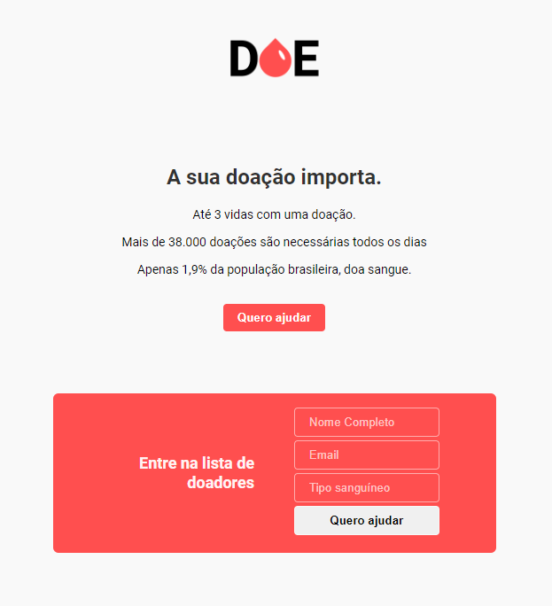
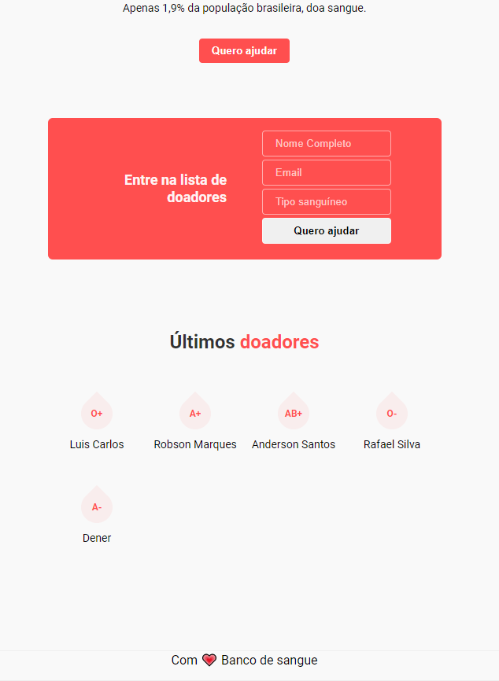

## Projeto desenvolvido durante a terceira MaratonaDev da Rocketseat

### Tecnologias usadas no front-end
 - HTML
 - CSS
 - JS

### Tecnologias usadas no back-end
 - [Node](https://nodejs.org/en/docs/)
 - [Express](https://devdocs.io/express/)
 - [PostgreSQL](https://www.postgresql.org/docs/) - SGBDR
 - [Postbird](https://www.electronjs.org/apps/postbird) - PostgreSQL GUI client
 - [Nunjucks](https://mozilla.github.io/nunjucks/) - Template engine

# DOE VIDA!

